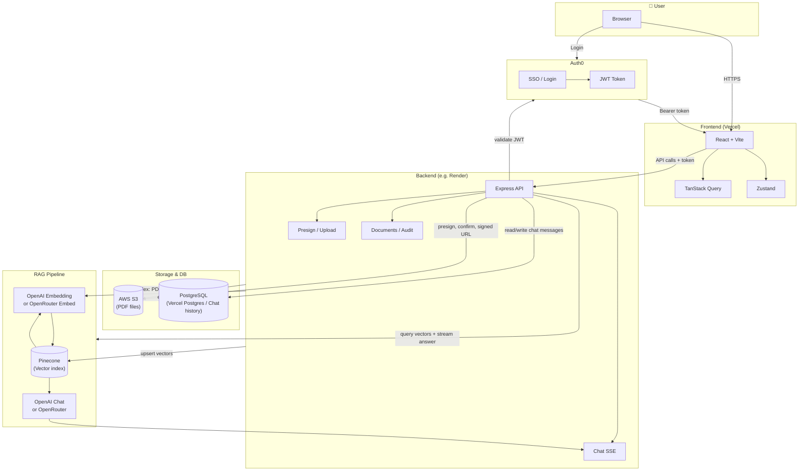

# LegalMind AI

Full-stack legal research and document assistant: React + Vite frontend, Node.js backend, RAG over legal PDFs.
Full A-to-Z setup (Auth0, Railway, Vercel, Vercel AI SDK, etc.)

## System design — How our system

The frontend runs in the user’s browser and is deployed on Vercel. Users authenticate through Auth0. After login, the frontend communicates with the backend (hosted on a platform such as Render) via API requests. The backend manages PDF storage using Amazon S3, performs Retrieval-Augmented Generation (RAG) using Pinecone for vector search and OpenAI/OpenRouter for the language model, and stores chat history in a PostgreSQL database (e.g., Vercel Postgres).



**Component roles**

| Component | Role |
|-----------|------|
| **Vercel** | Hosts React frontend; env `VITE_API_BASE_URL` points to backend. |
| **Auth0** | SSO, JWT issue, silent refresh; backend validates token and reads role. |
| **Render** (or other host) | Runs Express backend; env for S3, Pinecone, OpenAI/OpenRouter, DB. |
| **Vercel Postgres** (or any Postgres) | `DATABASE_URL` — chat message history; optional. |
| **Pinecone** | Vector index; document chunks + embeddings; RAG retrieval. |
| **AWS S3** | PDF storage; presigned upload + signed read for PDF viewer. |
| **OpenAI** | Embeddings (e.g. `text-embedding-3-small`) and/or chat (e.g. `gpt-4o-mini`). |
| **OpenRouter** | Optional: chat and/or embeddings (free models); set `OPENROUTER_API_KEY` + model env. |

**Request flow (short)**

1. **Login:** Browser → Auth0 → JWT → frontend stores token, sends `Authorization: Bearer …` to backend.
2. **Upload:** Frontend asks backend for presign → backend returns S3 presigned URL (or chunk URL) → frontend uploads file → backend confirms and triggers indexing (PDF → chunks → embeddings → Pinecone).
3. **Chat:** Frontend sends messages to `POST /api/chat` with token → backend retrieves chunks from Pinecone, calls OpenAI/OpenRouter, streams SSE (Vercel AI SDK format) → optional: save messages to Postgres.
4. **Citation/PDF:** User clicks citation → frontend calls `GET /api/documents/:id/pdf-url` → backend returns signed S3 URL → PDF viewer opens at page.

## Structure

- **frontend/** — React (TanStack Query, Zustand), Tailwind, Shadcn-style UI, SSE chat, chunked uploads, RBAC, ErrorBoundary, toasts.
- **backend/** — Express: `/api/auth/me`, `/api/documents`, presign, chunk uploads, `/api/chat/stream` (SSE), `/api/audit-logs`. In-memory for dev.
- **e2e/** — Playwright: `login.spec.ts`, `upload.spec.ts`, `chat.spec.ts`.

## Run

1. **Backend** (required for auth + chat + documents):
   ```bash
   cd backend && npm install && npm run dev
   ```
   Listens on `http://localhost:8787`.

2. **Frontend**:
   ```bash
   cd frontend && npm install && npm run dev
   ```
   Open `http://localhost:5173`. Set `VITE_API_BASE_URL=http://localhost:8787` if backend is on another host.

3. **Unit tests** (frontend):
   ```bash
   cd frontend && npm run test:run
   ```

4. **E2E** (start backend + frontend first, then):
   ```bash
   cd e2e && npm install && npx playwright install chromium && npm test
   ```

## Auth0 SSO

To use Auth0 instead of dev-mode login:

1. **Auth0 Dashboard**: Create an Application (SPA) and an API. Note:
   - **Domain** (e.g. `your-tenant.auth0.com`)
   - **Client ID**
   - **API Identifier** (audience, e.g. `https://api.legalmind.com`)

2. **Frontend**: Copy `frontend/.env.example` to `frontend/.env` and set:
   - `VITE_AUTH0_DOMAIN`
   - `VITE_AUTH0_CLIENT_ID`
   - `VITE_AUTH0_AUDIENCE` (same as API identifier)

3. **Backend**: Copy `backend/.env.example` to `backend/.env` and set:
   - `AUTH0_DOMAIN`
   - `AUTH0_AUDIENCE` (same value as frontend)

4. **Auth0 Application**: Set *Allowed Callback URLs* to `http://localhost:5173` (and your production URL). Set *Allowed Logout URLs* and *Allowed Web Origins* as needed.

5. Restart frontend and backend. “Continue with SSO” will redirect to Auth0; after login, the backend validates the JWT and returns the user (role from custom claim `https://legalmind.app/role` or Auth0 rule, else `associate`).

## RAG (Pinecone + OpenAI)

For answers grounded in your uploaded PDFs:

1. **S3** must be enabled so PDFs are stored (see [docs/AWS_S3_SETUP.md](./docs/AWS_S3_SETUP.md)).
2. **Pinecone** and **OpenAI** (see [docs/PINECONE_SETUP.md](./docs/PINECONE_SETUP.md)): set `PINECONE_API_KEY`, `PINECONE_INDEX`, and `OPENAI_API_KEY` in the backend `.env`.

Then: uploads to S3 are indexed (text → chunks → embeddings → Pinecone), and chat streams answers from OpenAI using retrieved chunks as context.

